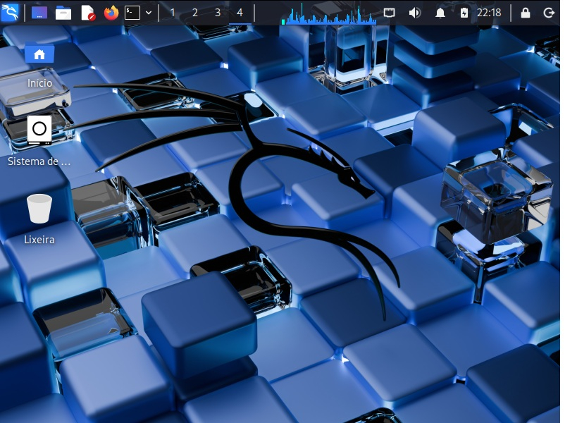

# 💻 Kali Linux 

## A distribuição mais avançada para testes de penetração

🎯 O Kali Linux é uma distribuição Linux de código aberto, baseada em Debian, voltada para diversas tarefas de segurança da informação, como testes de penetração, pesquisa de segurança, perícia forense computacional e engenharia reversa.

