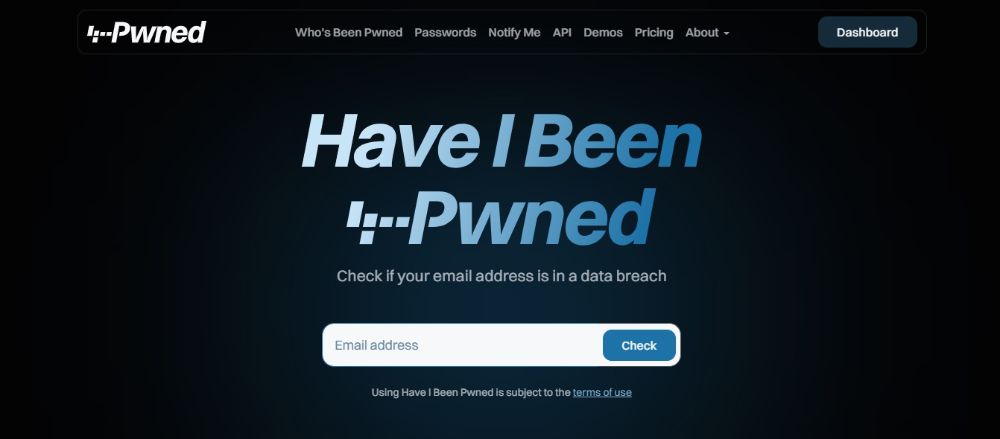
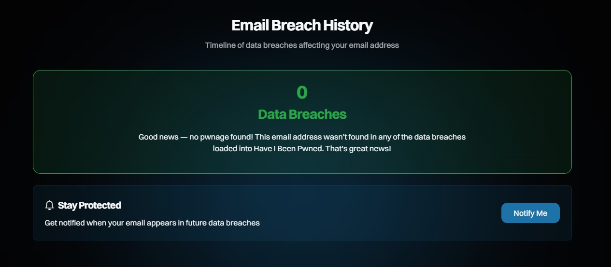
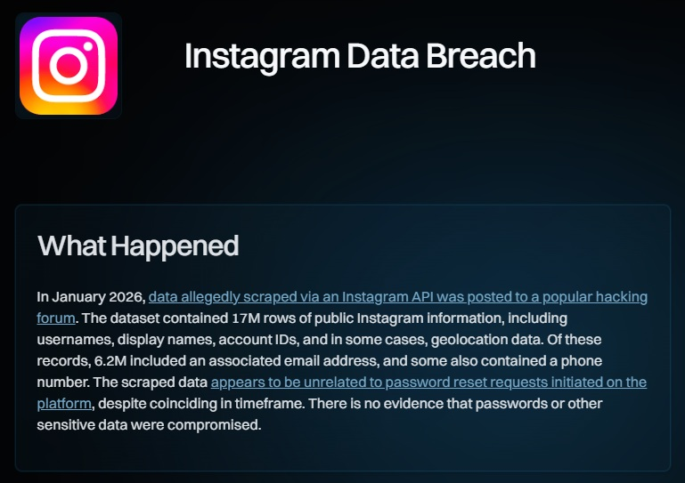
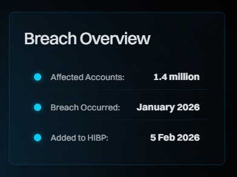
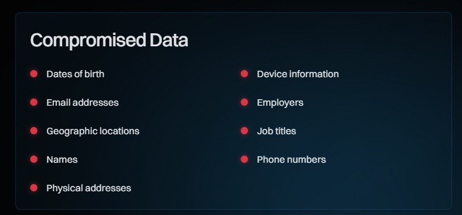

# 💻 Have I Been Pwned?

[Link para o site: Have I Been Pwned](https://haveibeenpwned.com/)


## O que é o "Have I Been Pwned?"

"Have I Been Pwned?" (HIBP) é um site gratuito que permite a qualquer pessoa verificar se suas informações pessoais, como e-mail ou senhas, foram comprometidas em vazamentos de dados conhecidos. O termo "pwned", uma gíria da comunidade de jogos, significa ter sido derrotado ou controlado, o que, no contexto da cibersegurança, se refere ao comprometimento de uma conta ou sistema.




A plataforma foi criada em dezembro de 2013 pelo especialista em segurança australiano Troy Hunt. Hunt, uma figura respeitada na área de segurança da informação, desenvolveu o HIBP como um serviço público para ajudar as pessoas a entenderem a frequência e a gravidade dos vazamentos de dados. Hoje, o site é uma das ferramentas mais confiáveis do mundo para essa finalidade, utilizado por milhões de usuários, empresas e até governos.


## Para que serve essa ferramenta?

Ela ajuda você a:

- Descobrir se seus dados foram vazados:
  
Ao digitar seu e‑mail ou telefone, o site verifica em uma base gigantesca de vazamentos públicos.

- Entender onde ocorreu o vazamento: 

Ele mostra em quais serviços suas informações apareceram (por exemplo: LinkedIn, Dropbox, Adobe, etc.).

- Avaliar riscos

Se sua senha vazou, você sabe que precisa trocá-la imediatamente.

- Criar senhas mais seguras

O site também tem um recurso chamado Pwned Passwords, que permite verificar se uma senha específica já apareceu em vazamentos — sem revelar a senha para o site.

- Receber alertas

Você pode cadastrar seu e‑mail para ser avisado quando ele aparecer em novos vazamentos.

## Verificando seu E-mail e Interpretando os Resultados

**Passo 1:** Acessando o Site e Realizando a Consulta

Acesse o site oficial **https://haveibeenpwned.com**. Na página inicial, você encontrará um campo de busca. Digite o endereço de e-mail que deseja verificar e clique no botão "pwned?".

**Passo 2:** Interpretando os Resultados

Existem dois resultados possíveis para sua consulta:


### Cenário A: E-mail Seguro (Good news — no pwnage found!)

Se o seu e-mail não foi encontrado em nenhuma base de dados vazada conhecida pelo HIBP, você receberá uma boa notícia com uma tela verde.
Mensagem de Confirmação: A frase "Good news — no pwnage found!" indica que, até o momento, seu e-mail está seguro de acordo com os registros do site.
"Stay Protected": Mesmo estando seguro, você ainda pode se inscrever para receber alertas caso seu e-mail apareça em futuros vazamentos.




### Cenário B: E-mail Comprometido (Oh no — pwned! )
Se o seu e-mail foi encontrado, uma tela vermelha de alerta será exibida, indicando em quantos vazamentos ele apareceu.
Caixa de Alerta: A mensagem "Oh no — pwned!" confirma que seu e-mail foi encontrado. O número (neste exemplo, "82 Data Breaches") mostra a quantidade de incidentes em que seus dados foram expostos.


## Testando com um e-mail que com certeza aparace em vazamentos

O HIBP permite consultar domínios públicos conhecidos por testes, como:

```
test@example.com
admin@example.com
```

Esses endereços são amplamente usados em exemplos e documentações, e não pertencem a usuários reais.
Eles costumam aparecer em bases de dados vazadas porque muitos sistemas os usam como contas de teste.

### Exemplos de resultados encontrados

#### 🔍 O que aconteceu

Em janeiro de 2026, dados do Instagram foram coletados (scrapeados) por meio de uma API e depois publicados em um fórum de hackers.



O conjunto de dados tinha 17 milhões de registros com informações públicas de perfis, como:

- nome de usuário

- nome exibido

- ID da conta

- localização (em alguns casos)


#### Breach Overview

A seguir um resumo rápido de um vazamento de dados registrado no site Have I Been Pwned (HIBP). Ele apresenta três informações principais:



**1. Affected Accounts:** 1.4 million

Significa que 1,4 milhão de contas foram afetadas pelo vazamento.
Ou seja, esse foi o número total de usuários que tiveram algum dado exposto.

**2. Breach Occurred:** January 2026

Indica que o vazamento aconteceu em janeiro de 2026.
É a data em que os dados foram obtidos ou expostos pela primeira vez.

**3. Added to HIBP:** 5 Feb 2026

Mostra quando esse incidente foi adicionado ao banco de dados do Have I Been Pwned — no caso, 5 de fevereiro de 2026.
Isso significa que, a partir dessa data, os usuários puderam verificar se suas informações estavam entre as vazadas.


## Compromised Data

Essa parte mostra quais tipos de informações foram expostas no vazamento de dados. É como uma lista dizendo exatamente que dados seus podem ter sido incluídos no incidente.



- Dates of birth
  
Datas de nascimento. Se estiver marcado, significa que esse dado pode ter sido vazado.

- Email addresses
  
Endereços de e‑mail associados à conta.

- Geographic locations
  
Informações sobre localização, como cidade, estado ou país.

- Names
  
Seu nome real, caso estivesse vinculado ao serviço.

- Physical addresses
  
Endereço físico (rua, número, etc.), se o serviço coletava isso.

- Device information
  
Informações sobre o dispositivo usado, como modelo do celular, sistema operacional ou identificadores técnicos.

- Employers

Nome da empresa onde você trabalha, se esse dado fazia parte do cadastro.

- Job titles

Seu cargo profissional.

- Phone numbers

Número de telefone associado à conta.


## Conclusão

O Have I Been Pwned? se tornou uma ferramenta indispensável em um cenário onde vazamentos de dados são cada vez mais frequentes. Ele permite que qualquer pessoa — de usuários comuns a grandes empresas — monitore sua exposição digital e tome decisões rápidas para reduzir riscos. Ao verificar seus e‑mails, entender onde ocorreram incidentes e acompanhar novos vazamentos, você fortalece sua postura de segurança e evita que informações sensíveis sejam exploradas por terceiros.

Manter senhas fortes, habilitar autenticação em dois fatores e monitorar continuamente sua presença online são passos essenciais para proteger sua identidade digital. Em um mundo onde a informação é um dos ativos mais valiosos, estar atento é mais do que uma recomendação: é uma necessidade.

Se ainda não verificou seus dados, vale a pena acessar o HIBP e começar agora mesmo a cuidar da sua segurança. Afinal, prevenção é sempre o melhor caminho.


